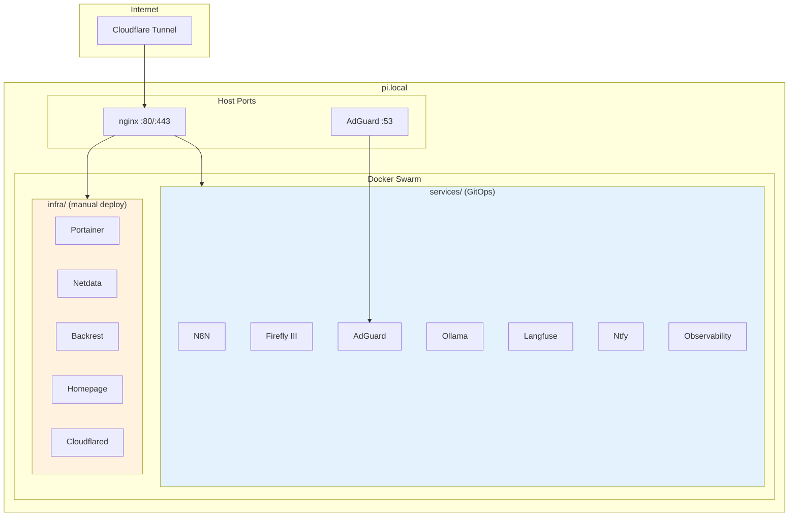

# RP5 Home Server

Raspberry Pi 5 (8GB) home server running single-node Docker Swarm with ARM64-optimized containers.

## Architecture



## Structure

| Directory | Deployment | Description |
|-----------|------------|-------------|
| `infra/` | `./scripts/sync_infra.sh` | Core infrastructure: nginx, portainer, backrest, homepage |
| `services/` | Portainer GitOps | Application stacks deployed via webhook |
| `docs/` | — | Architecture documentation |
| `cloud/` | Terraform | Cloudflare, GCS resources |

## Documentation

| Document | Purpose |
|----------|---------|
| [Setup](./setup.md) | Initial deployment, Docker Swarm init |
| [Cloud](./cloud.md) | Terraform: Cloudflare tunnel, GCS backup bucket |
| [Networking](./networking.md) | Network topology, DNS resolution, nginx routing |
| [Backup](./backup.md) | Backrest setup, restore procedures |
| [GitOps](./gitops.md) | Portainer webhooks, automated deployment |
| [Monitoring](./monitoring.md) | Observability stack (Grafana, Loki, Tempo, Prometheus) |
| [Naming and Labels](./naming_labels.md) | Docker label schema for service identification |

## Services

| Service | URL | Stack |
|---------|-----|-------|
| Homepage | `https://homepage.home` | infra |
| Portainer | `https://portainer.home` | infra |
| Netdata | `https://netdata.home` | infra |
| Backrest | `https://backrest.home` | infra |
| N8N | `https://n8n.home` | services/n8n |
| Firefly III | `https://firefly.home` | services/firefly |
| AdGuard | `https://adguard.home` | services/adguard |
| Ollama | `https://ollama.home` | services/ollama |
| Langfuse | `https://langfuse.home` | services/langfuse |
| Ntfy | `https://ntfy.home` | services/ntfy |
| Grafana | `https://grafana.home` | services/observability |

## Quick Start

```bash
# 1. Initialize Swarm
ssh pi@pi.local "docker swarm init"

# 2. Create secrets, copy infra, deploy
./scripts/sync_infra.sh

# 3. Deploy services via Portainer GitOps
# Access https://portainer.home → Stacks → Git Repository
```

See [Setup](./setup.md) for complete instructions.
