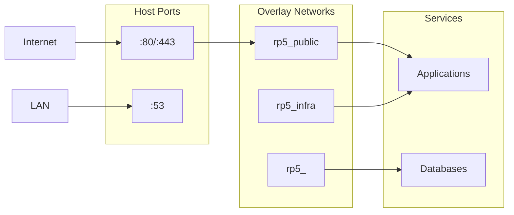

# Networking

Network topology, DNS resolution, and routing for single-node Docker Swarm.

## Network Layers



## Port Exposure Strategy

| Type | Directive | Scope | Use Case |
|------|-----------|-------|----------|
| Host | `ports:` | Internet/LAN | nginx (80/443), AdGuard DNS (53) |
| Overlay | `expose:` | Swarm internal | All other services |

**Rule**: Only nginx and AdGuard bind host ports. All other services use `expose` for overlay network access.

## Networks

| Network | Type | Purpose |
|---------|------|---------|
| `rp5_public` | External overlay | nginx → proxied services |
| `rp5_infra` | External overlay | Infrastructure services |
| `rp5_observability` | External overlay | Alloy → service exporters |
| `rp5_<stack>` | Stack overlay | Private per-stack communication |

Services join `rp5_public` only if nginx-proxied. Databases stay on private stack networks.

### Network Deployment Order

External networks must exist before stacks that reference them. **Deploy in this order:**

1. **Create external networks** (one-time setup):
   ```bash
   docker network create --driver overlay --attachable rp5_public
   docker network create --driver overlay --attachable rp5_infra
   docker network create --driver overlay --attachable rp5_observability
   ```

2. **Deploy infra stack** (creates no external networks, uses `rp5_public` and `rp5_infra`)

3. **Deploy observability stack** (services join `rp5_observability` for metric scraping)

4. **Deploy service stacks** (n8n, firefly, langfuse, etc.)

> **Note:** `depends_on` is ignored in Docker Swarm. Services start simultaneously and rely on healthchecks + restart policies for eventual consistency.

## Nginx Routing

nginx reverse-proxies all `.home` domains to internal services via overlay DNS.

| Domain | Service | Port |
|--------|---------|------|
| `portainer.home` | `infra_management` | 9000 |
| `netdata.home` | `infra_monitoring` | 19999 |
| `backrest.home` | `infra_backup` | 9898 |
| `homepage.home` | `infra_dashboard` | 3000 |
| `n8n.home` | `n8n_app` | 5678 |
| `firefly.home` | `firefly_app` | 8080 |
| `firefly-importer.home` | `firefly_importer` | 8080 |
| `firefly-pico.home` | `firefly_pico` | 80 |
| `adguard.home` | `adguard_dns` | 3000 |
| `ollama.home` | `ollama_llm` | 11434 |
| `grafana.home` | `observability_dashboard` | 3000 |
| `langfuse.home` | `langfuse_app` | 3000 |
| `ntfy.home` | `ntfy_app` | 80 |

**DNS Format**: `<stack>_<service>` (Swarm cross-stack resolution).

## DNS Resolution

Configure clients to resolve `.home` domains to the Pi's IP address.

### AdGuard DNS Rewrites (Recommended)

1. Access `https://adguard.home`
2. **Filters** → **DNS rewrites** → **Add DNS rewrite**
3. Add wildcard:
   - **Domain**: `*.home`
   - **IP Address**: `192.168.1.100` (Pi's IP)

This resolves all `.home` domains to the Pi. nginx routes to individual services.

### Client Configuration

**Network-wide** (recommended): Set Pi's IP as primary DNS in router DHCP settings.

**Per-device**: Edit `/etc/hosts` (Linux/macOS) or `C:\Windows\System32\drivers\etc\hosts`:
```
192.168.1.100 portainer.home netdata.home backrest.home homepage.home
192.168.1.100 firefly.home n8n.home grafana.home langfuse.home ntfy.home
```

### Static IP for Pi

Ensure Pi has static IP to avoid DNS resolution issues:

**Option 1**: DHCP reservation in router (recommended)  
**Option 2**: Static config in `/etc/dhcpcd.conf`:
```bash
interface eth0
static ip_address=192.168.1.100/24
static routers=192.168.1.1
static domain_name_servers=1.1.1.1 8.8.8.8
```

## Service Configuration

```yaml
# Nginx-proxied service
networks:
  - <stack>_network      # Private
  - public_network       # nginx access

# Database (internal only)
networks:
  - <stack>_network      # Private only
```

## Verification

```bash
# Check DNS resolution
nslookup portainer.home

# Check service ports
docker ps --format 'table {{.Names}}\t{{.Ports}}'

# Test connectivity from nginx
docker exec $(docker ps -q -f name=infra_proxy) nc -zv n8n_app 5678

# DNS resolution inside Swarm
docker exec $(docker ps -q -f name=infra_proxy) nslookup firefly_app
```
