# Network Architecture

Complete network topology and port mapping for the RP5 home server.

## Network Design Principles

1. **Single Entry Point**: Nginx reverse proxy is the only web entry point (ports 80/443)
2. **Overlay Networks**: Services communicate via Docker Swarm overlay networks
3. **DNS Exceptions**: AdGuard DNS requires host-level port exposure for DNS functionality
4. **Security**: Services use `expose` (overlay network only), not `ports` (host network)

## Network Topology

```mermaid
%%{init: {'theme':'base'}}%%
graph TB
    subgraph Internet["☁️ INTERNET"]
        CF[Cloudflare Tunnel]
    end
    
    subgraph Host["🖥️ HOST NETWORK - pi.local"]
        subgraph HostPorts["Host Exposed Ports"]
            Nginx["🔒 Nginx<br/>80/tcp, 443/tcp"]
            AdGuardHost["🛡️ AdGuard DNS<br/>53, 853, 5443"]
        end
        
        subgraph Swarm["🐳 Docker Swarm Overlay Networks"]
            subgraph PublicNet["rp5_public - Public Network"]
                direction LR
                Firefly["💰 Firefly III<br/>:8080"]
                Importer["📥 Firefly Importer<br/>:8080"]
                Pico["📱 Firefly Pico<br/>:80"]
                N8N["🔄 N8N<br/>:5678"]
                Ollama["🤖 Ollama<br/>:11434"]
                Homepage["🏠 Homepage<br/>:3000"]
                AdGuardWeb["🛡️ AdGuard Web<br/>:3000"]
            end
            
            subgraph InfraNet["rp5_infra - Infrastructure Network"]
                direction LR
                Portainer["🐋 Portainer<br/>:9000"]
                Netdata["📊 Netdata<br/>:19999"]
                Backrest["💾 Backrest<br/>:9898"]
                Cloudflared["☁️ Cloudflared<br/>(no port)"]
                Homepage2["🏠 Homepage<br/>:3000"]
            end
            
            subgraph FireflyNet["rp5_firefly - Firefly Private Network"]
                direction LR
                FireflyDB["🗄️ MariaDB"]
                PicoDB["🗄️ PostgreSQL"]
                Cron["⏰ Cron"]
            end
            
            subgraph N8NNet["rp5_n8n - N8N Private Network"]
                N8NDB["🗄️ PostgreSQL"]
            end
            
            subgraph AdGuardNet["rp5_adguard - AdGuard Private Network"]
                AdGuardPriv["🛡️ AdGuard"]
            end
            
            subgraph OllamaNet["rp5_ollama - Ollama Private Network"]
                OllamaPriv["🤖 Ollama"]
            end
        end
    end
    
    CF --> Nginx
    
    Nginx -.->|reverse proxy| Firefly
    Nginx -.->|reverse proxy| Importer
    Nginx -.->|reverse proxy| Pico
    Nginx -.->|reverse proxy| N8N
    Nginx -.->|reverse proxy| Ollama
    Nginx -.->|reverse proxy| Homepage
    Nginx -.->|reverse proxy| AdGuardWeb
    Nginx -.->|reverse proxy| Portainer
    Nginx -.->|reverse proxy| Netdata
    Nginx -.->|reverse proxy| Backrest
    Nginx -.->|reverse proxy| Homepage2
    
    Firefly -.-> FireflyDB
    Pico -.-> PicoDB
    Firefly -.-> Cron
    N8N -.-> N8NDB
    AdGuardWeb -.-> AdGuardPriv
    Ollama -.-> OllamaPriv
    
    Cloudflared -.->|tunnel| Nginx
    
    style Nginx fill:#4CAF50,stroke:#2E7D32,color:#fff
    style AdGuardHost fill:#00BCD4,stroke:#0097A7,color:#fff
    style PublicNet fill:#E3F2FD,stroke:#1976D2
    style InfraNet fill:#FFF3E0,stroke:#F57C00
    style FireflyNet fill:#F3E5F5,stroke:#7B1FA2
    style N8NNet fill:#FCE4EC,stroke:#C2185B
    style AdGuardNet fill:#E0F2F1,stroke:#00796B
    style OllamaNet fill:#FFF9C4,stroke:#F57F17
```



## Network Layers


## Nginx Reverse Proxy Routing

Nginx (listening on host ports 80/443) routes to internal services:

```
External Request → Nginx (80/443) → Internal Service (overlay network)
```

### Service Routing Table

| Domain | Backend Service | Backend Port | Protocol | Notes |
|--------|----------------|--------------|----------|-------|
| `portainer.local` | `portainer` | 9000 | HTTP | Docker management |
| `n8n.local` | `n8n` | 5678 | HTTP + WS | Workflow automation |
| `ollama.local` | `ollama` | 11434 | HTTP | LLM inference |
| `netdata.local` | `netdata` | 19999 | HTTP | System monitoring |
| `backrest.local` | `backrest` | 9898 | HTTP | Backup management |
| `firefly.local` | `firefly` | 8080 | HTTP | Financial management |
| `firefly-importer.local` | `firefly-importer` | 8080 | HTTP | Data import |
| `firefly-pico.local` | `firefly-pico` | **80** | HTTP | Mobile companion |
| `homepage.local` | `homepage` | 3000 | HTTP | Dashboard |
| `adguard.local` | `adguard` | 3000 | HTTP | DNS web UI |

## Port Exposure Strategy

### Host-Level Ports (Direct Binding)

**Only these services bind to host ports:**

| Service | Ports | Protocol | Purpose |
|---------|-------|----------|---------|
| **Nginx** | 80 | TCP | HTTP entry point |
| **Nginx** | 443 | TCP | HTTPS entry point |
| **AdGuard** | 53 | TCP/UDP | DNS queries |
| **AdGuard** | 853 | TCP/UDP | DNS-over-TLS |
| **AdGuard** | 5443 | TCP/UDP | DNSCrypt |

### Overlay Network Ports (Internal Only)

All other services use `expose` directive, making ports available **only on Docker overlay networks**:

```yaml
# Correct - overlay network only
expose:
  - "8080"

# Incorrect - would expose to host
ports:
  - "8080:8080"
```

## Firefly Pico Internal Architecture

Special case: Pico has internal routing via nginx inside the container.

### Request Flow

```mermaid
%%{init: {'theme':'base'}}%%
sequenceDiagram
    participant Client as 🌐 Client Browser
    participant ExtNginx as 🔒 External Nginx<br/>(Host)
    participant PicoNginx as 🔧 Pico Nginx<br/>(:80)
    participant Nuxt as ⚡ Nuxt Frontend<br/>(:3000)
    participant PHP as 🐘 PHP-FPM<br/>(:9000)
    participant Laravel as 🎨 Laravel API
    participant Firefly as 💰 Firefly III API<br/>(:8080)
    
    Note over Client,Firefly: Request Flow for /api/user
    Client->>ExtNginx: HTTPS /api/user
    ExtNginx->>PicoNginx: HTTP firefly-pico:80/api/user
    PicoNginx->>PHP: FastCGI localhost:9000
    PHP->>Laravel: Execute PHP code
    Laravel->>Firefly: GET http://firefly:8080/api/v1/about
    Firefly-->>Laravel: JSON response
    Laravel-->>PHP: JSON response
    PHP-->>PicoNginx: JSON response
    PicoNginx-->>ExtNginx: JSON response
    ExtNginx-->>Client: HTTPS JSON response
    
    Note over Client,Firefly: Request Flow for /_nuxt/app.js
    Client->>ExtNginx: HTTPS /_nuxt/app.js
    ExtNginx->>PicoNginx: HTTP firefly-pico:80/_nuxt/app.js
    PicoNginx->>Nuxt: Proxy localhost:3000
    Nuxt-->>PicoNginx: JavaScript file
    PicoNginx-->>ExtNginx: JavaScript file
    ExtNginx-->>Client: HTTPS JavaScript
```




### Pico Container Internal Ports

```mermaid
%%{init: {'theme':'base'}}%%
graph TB
    subgraph Container["🐳 firefly-pico Container"]
        subgraph Exposed["Exposed to Overlay Network"]
            Port80["Port 80<br/>Internal Nginx"]
        end
        
        subgraph Internal["Internal (localhost only)"]
            Port3000["Port 3000<br/>Nuxt.js Frontend"]
            Port9000["Port 9000<br/>PHP-FPM"]
        end
        
        Port80 -->|"Location /api/*"| Port9000
        Port80 -->|"Location /_nuxt/*"| Port3000
        Port80 -->|"Location /*"| Port3000
        
        Port9000 --> Laravel["Laravel<br/>Backend"]
        Port3000 --> Nuxt["Nuxt<br/>Frontend"]
    end
    
    ExtNginx["External Nginx"] -->|"firefly-pico:80"| Port80
    
    style Port80 fill:#4CAF50,stroke:#2E7D32,color:#fff
    style Port3000 fill:#FF9800,stroke:#E65100,color:#fff
    style Port9000 fill:#2196F3,stroke:#1565C0,color:#fff
    style ExtNginx fill:#9C27B0,stroke:#6A1B9A,color:#fff
```




### Why Port 80 (Not 3000)?

| Connection | Result | Reason |
|------------|--------|--------|
| `firefly-pico:3000` | ❌ API calls fail | Direct to Nuxt, bypasses nginx routing |
| `firefly-pico:80` | ✅ API works | Nginx routes `/api/*` to PHP-FPM |

**Critical**: External nginx must connect to `firefly-pico:80` (not `:3000`) to get proper API routing.

## Network Security

### Firewall Rules

```
┌─────────────────────────────────────────────────────────────┐
│  Internet → Cloudflare Tunnel → Nginx (443) → Services      │
│  LAN → Nginx (80/443) → Services                             │
│  LAN → AdGuard (53, 853, 5443) → DNS                         │
│  Services ↔ Overlay Networks (internal only)                 │
└─────────────────────────────────────────────────────────────┘
```

### Service Isolation

- Each service stack has its own private overlay network
- Services join `rp5_public` network only if they need nginx access
- Infrastructure services use `rp5_infra` network
- Databases remain on private networks, never exposed to public network

### CORS Configuration

Firefly III API has CORS headers for Pico:

```nginx
location /api/ {
    add_header 'Access-Control-Allow-Origin' 'https://firefly-pico.local' always;
    add_header 'Access-Control-Allow-Methods' 'GET, POST, PUT, DELETE, OPTIONS' always;
    add_header 'Access-Control-Allow-Headers' 'Authorization, Content-Type' always;
}
```

## Network Verification

### Check Running Services

```bash
docker ps --format 'table {{.Names}}\t{{.Ports}}'
```

### Verify Overlay Network Connectivity

```bash
# From nginx container, test backend connectivity
docker exec $(docker ps --filter 'name=infra_nginx' --format '{{.Names}}') \
  nc -zv firefly-pico 80

# Should return: firefly-pico (10.0.x.x:80) open
```

### Check Service Resolution

```bash
# DNS resolution within overlay network
docker exec $(docker ps --filter 'name=infra_nginx' --format '{{.Names}}') \
  nslookup firefly-pico
```

## Troubleshooting

### Service Not Accessible via Nginx

1. Check service is on `rp5_public` network
2. Verify correct port in `expose` directive
3. Confirm nginx backend configuration matches exposed port
4. Test direct connectivity: `docker exec nginx_container nc -zv service_name port`

### DNS Resolution Fails

1. Check service is on same overlay network as client
2. Use service name (not hostname) for DNS: `firefly-pico` not `firefly_pico`
3. Verify Docker DNS resolver: `127.0.0.11` should be in `/etc/resolv.conf`

### Port Conflicts

If services fail to start due to port conflicts:

1. Check host-level ports: `sudo netstat -tlnp | grep ':<port>'`
2. Verify only nginx and AdGuard use host ports
3. All other services should use `expose`, not `ports`

## Migration Notes

### Changed Port Mappings (2025-11-09)

**Firefly Pico:**
- **Before**: Exposed port 3000 (Nuxt frontend directly) → API calls failed
- **After**: Expose port 80 (internal nginx) → Proper routing to Laravel backend
- **Reason**: Direct Nuxt access bypassed internal nginx routing, breaking API calls

**Impact**: Requires nginx config update + service redeployment.

## Best Practices

1. **Always use `expose`** for services behind nginx
2. **Use `ports`** only for DNS (AdGuard) or direct host access requirements
3. **Test connectivity** from nginx container before adding to config
4. **Document port changes** in this file when modifying services
5. **Verify overlay network** membership for all services needing nginx access
