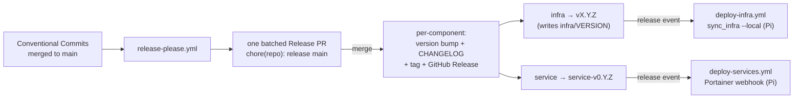

# Releases & Versioning

Automated versioning, changelogs, and tags via [release-please](https://github.com/googleapis/release-please). This is the diagram-led companion to the **[Pull requests & commit titles](../AGENTS.md#pull-requests--commit-titles--mandatory-format)** rules in `AGENTS.md` (the authoritative, imperative contract). Read them together.

release-please cuts versions, changelogs, and tags. **The runtime deploys are release-gated off those tags** — merging a feature PR *stages* a change; merging the Release PR *ships* it. The one exception is `cloud/` Terraform, which stays plan-reviewed-on-merge (see [Deployment](#deployment-release-gated)).

## Workflows

| Workflow | File | Trigger | Role |
|---|---|---|---|
| **release-please** | `release-please.yml` | push to `main` | Parses Conventional Commits, maintains one batched Release PR; merging it bumps versions + `CHANGELOG.md` and publishes per-component tags + GitHub Releases. |
| **PR title** | `pr-title.yml` | PR opened/edited/reopened/synced | Validates the PR title is a Conventional Commit with a mandatory scope. Skips `release-please--*` PRs. |
| **Deploy infra** | `deploy-infra.yml` | **`infra` release** (`v*`) + manual | Self-hosted Pi runner runs `sync_infra.sh --local`. |
| **Deploy services** | `deploy-services.yml` | **service release** (`<stack>-v*`) + manual | Parses the stack from the tag, POSTs its Portainer webhook on the Pi. |
| **Apply cloud** | `apply-cloud.yml` | push `main` ∩ `cloud/**` | `terraform apply` — plan-reviewed-on-merge, **not** release-gated. |

## Components

Manifest mode: [`release-please-config.json`](../release-please-config.json) + [`.release-please-manifest.json`](../.release-please-manifest.json) (the version source of truth — **never hand-edit** it or the generated `CHANGELOG.md` files). A commit affects a component only when it touches files under that component's path.

| Component | Path | release-type | Tag | Version source |
|---|---|---|---|---|
| *(infra)* | `infra` | `simple` | `vX.Y.Z` | `infra/VERSION` (via `version-file`) |
| `cloud` | `cloud` | `simple` | `cloud-vX.Y.Z` | manifest-only |
| `mcp-connector` | `workers/mcp-connector` | `node` | `mcp-connector-vX.Y.Z` | `package.json` |
| `<service>` | `services/<service>` | `simple` | `<service>-vX.Y.Z` | manifest-only |

Services covered: `adguard`, `ai`, `firefly`, `greenhouse`, `langfuse`, `n8n`, `ntfy`, `observability`, `openclaw`.

Cross-cutting changes (CI, root docs, `scripts/`) use the `repo` scope, touch no component path, and cut **no** release.

## Deployment (release-gated)

The runtime stacks deploy **when their release is published**, not on merge to `main`:

| Target | Deployed by | Fires on | How |
|---|---|---|---|
| `infra/` stack | `deploy-infra.yml` | `infra` release (bare `v*` tag) | self-hosted Pi runner → `sync_infra.sh --local` |
| `services/<stack>` | `deploy-services.yml` | service release (`<stack>-v*` tag) | Pi runner → that stack's Portainer webhook (local, bypasses CF WAF) |
| `cloud/` Terraform | `apply-cloud.yml` | **push** `main` ∩ `cloud/**` | `terraform apply` (plan-reviewed-on-merge — **not** release-gated) |

- The deploy workflows trigger on `release: [published]`. Because release-please authors the release with the **GitHub App** token (not `GITHUB_TOKEN`), the `release` event *does* fire downstream workflows.
- A batched Release PR publishes **one release per changed component**, so each fires its own deploy; `deploy-services.yml` parses the stack from the tag and no-ops on non-service releases (`infra`, `cloud`, `mcp-connector`).
- The release event checks out the **tagged commit**, so the deployed stack matches the released version. Cutting an `infra` release bumps `infra/VERSION`, which `sync_infra.sh` treats as the immutable-config redeploy trigger.
- Both Pi deploys also accept **`workflow_dispatch`** for manual runs (infra: `pull`/`restart`; services: a single `stack`).
- **Why `cloud/` is excluded:** Terraform is desired-state — release-gating it would let `main` diverge from applied infra until a release is cut. Its review gate is the plan (`ci.yml`), and merge applies it. release-please still versions `cloud` (`cloud-vX.Y.Z`) for the changelog/tag record.

## Versioning policy

- **`infra` is the one mature line** (`vX.Y.Z`, seeded `1.13.0`), the only component past `1.0.0`. Normal SemVer applies: `feat`→minor, `fix`/`perf`/`refactor`→patch, `feat!`/`BREAKING CHANGE:`→major.
- **Every other component is a `0.x` config track.** `bump-minor-pre-major: true` means a breaking change bumps **minor** while below `1.0.0` — nothing auto-graduates. Their **namespaced** tags (`greenhouse-v0.3.0`, …) keep them distinct from the vendored app's own version (e.g. Greenhouse `v3.x`, Grafana `11.x`): anything `0.x` is *this repo's config revision*, anything higher is the *upstream app*.
- **Graduate deliberately:** add a `Release-As: 1.0.0` footer to a commit scoped to that component's path. There is no automatic `1.0.0`.

> release-please is **SemVer-only** — CalVer/date-based versions aren't supported. The `0.x` namespacing above is the chosen way to avoid confusion with upstream versions.

### `infra/VERSION` is release-managed

`infra/VERSION` is the `infra` component's `version-file`: release-please rewrites it in place (kept as a bare `X.Y.Z` string, so `homepage` and `sync_infra.sh` read it unchanged). Because [`sync_infra.sh`](../scripts/sync_infra.sh) treats a changed `VERSION` as an immutable-config trigger, **cutting an `infra` release implies an infra stack redeploy on the next sync.** To change `infra/**` *without* a redeploy, use a non-releasing type (`chore(infra):` / `docs(infra):`).

## Commit contract → bump

| Type | Bump (`infra`, ≥1.0) | Bump (`0.x` tracks) | CHANGELOG section |
|---|---|---|---|
| `feat` | minor | minor | Features |
| `fix` | patch | patch | Bug Fixes |
| `perf` | patch | patch | Performance Improvements |
| `refactor` | patch | patch | Code Refactoring |
| `revert` | patch | patch | Reverts |
| `docs` | none | none | Documentation |
| `feat!` / `BREAKING CHANGE:` | **major** | minor | (under its type) |
| `style` · `test` · `build` · `ci` · `chore` | none | none | hidden |

Enforcement is three layers: **`pr-title.yml`** (CI gate on the title), the **`conventional-commit-guard.sh`** PreToolUse hook (local, per-developer via gitignored `.claude/settings.local.json` — blocks malformed agent commits), and **squash-merge with title = PR title**, which makes the validated title the commit release-please parses.

## Required GitHub configuration

Deploys are keyless (WIF) / Portainer; the only release-automation secrets are the **GitHub App** credentials:

| Secret | Used by | Purpose |
|---|---|---|
| `RELEASE_PLEASE_APP_ID` | `release-please.yml` (`actions/create-github-app-token@v2`) | Numeric App ID of the release-please GitHub App. |
| `RELEASE_PLEASE_APP_PRIVATE_KEY` | same | The App's `.pem`. Mints a short-lived installation token so the Release PR is **not** authored by `GITHUB_TOKEN`. |

**Why the App:** `main` requires the `gate` status check, and a PR opened by `GITHUB_TOKEN` does **not** trigger `on: pull_request` CI — so `gate` would never report and the Release PR could never merge. An App-authored PR triggers CI normally. App repo permissions: **Contents: R/W** + **Pull requests: R/W**, installed on this repo.

**Branch protection (`main`):** require both `gate` (from `ci.yml`) and `Validate PR title` (from `pr-title.yml`); squash-only merge with commit title = PR title.

## First run — clean slate

`bootstrap-sha` in the config pins the adoption commit, so the first Release PR contains only commits landed **after** release-please was adopted — earlier history is not back-filled. Once that first Release PR merges, `bootstrap-sha` is ignored and can be removed.
