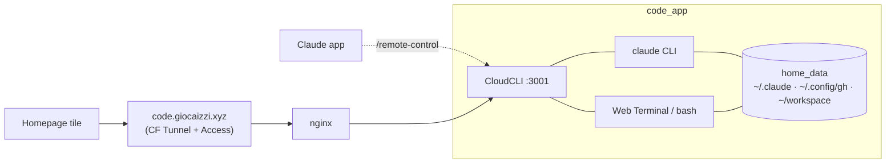

# 🤖 Code — Remote Claude Code dev environment

Self-hosted, always-on sandbox for running **Claude Code** on the Pi, driven from a
web/mobile UI ([CloudCLI](https://github.com/siteboon/claudecodeui)) at
`code.giocaizzi.xyz`. Spawn sessions against any git repo cloned into the
environment, then keep controlling them from the official Claude app via
`/remote-control`. Replaces a personal laptop as the place where Claude Code runs.

---

## 🚀 Quick Start

**1. Build & push the image** (Swarm ignores `build:`, so the image is prebuilt — mirrors OpenClaw):

```sh
docker buildx build --platform linux/arm64 \
  -t ghcr.io/giocaizzi/rp5-code:latest \
  --push services/code
```

**2. Deploy via Portainer** (Remote Stack → this repo → `services/code`).

**3. First-run auth** (interactive, one-time — persists in the `home_data` volume):

```sh
# Drop into the container
ssh giorgiocaizzi@pi.local 'docker exec -it $(docker ps -q -f name=code_app) bash'

# Authenticate Claude Code with your Max subscription (opens a login URL to paste a code)
claude            # then run /login, or just follow the first-run prompt
# Authenticate GitHub (for clone/push of private repos)
gh auth login
```

Both credentials land in `home_data` and survive restarts. The subscription login
(not a headless token) is what enables **Remote Control** from the official app.

**4. Open the UI:** `https://code.giocaizzi.xyz` (gated by Cloudflare Access — your email only).

---

## 📦 Architecture

| Service | Image                              | Port | Role                          |
|---------|------------------------------------|------|-------------------------------|
| `app`   | `ghcr.io/giocaizzi/rp5-code:latest`| 3001 | CloudCLI web/mobile UI + Claude Code CLI |



**Three control surfaces, one source of truth.** The UI, the official app (Remote
Control), and SSH/tmux all act on the same `~/.claude` session store in `home_data`.

**Preinstalled tooling** (what Claude reaches for): `git`, `gh`, `ripgrep`, `fd`,
`jq`, `yq`, `tree`, `build-essential` + `python3`/`pip`/`pipx`, `sqlite3`, `tmux`,
`vim`/`nano`, and net-debug (`nc`, `dig`, `ping`). Node 22 is the base.

**Security model:**
- Runs as `node` (uid 1000) — never root. `no-new-privileges` enforced.
- No host bind mounts, no Docker socket, no privileged mode. The in-browser shell
  is confined to this container, **not** the Pi host.
- Public access is gated end-to-end by Cloudflare Access (email allow-list).

---

## 🔐 Secrets

**None.** Auth is CLI-managed and persisted in the `home_data` volume (see
First-run auth above) — the same approach as OpenClaw. There are no Swarm secrets
and no tokens in the repo.

> If you ever recreate/wipe `home_data`, re-run the First-run auth steps.

---

## ⚙️ Configuration

### Spawn a new session for a repo

1. Open `https://code.giocaizzi.xyz` (or the Claude app).
2. Clone the repo — either:
   - in CloudCLI's **Web Terminal** (full bash): `gh repo clone owner/name ~/workspace/name`, or
   - let Claude do it: start a session and instruct *"clone `owner/name` and start"* (Claude clones via Bash).
3. Open the project folder, start a Claude Code session.
4. (Optional) inside the session run `/remote-control` to drive it from the official Claude app.

Many concurrent sessions: use separate CloudCLI projects, or `tmux` windows in the
Web Terminal (`Ctrl-b c` for a new window) — sessions persist across disconnects.

### Resume sessions

Transcripts live in `~/.claude/projects/<repo>/*.jsonl`. Resume with `claude --continue`
(latest in cwd) or `claude --resume <id>`; CloudCLI lists them automatically.

---

## ✅ Deploy verification

Confirm the UI binds on all interfaces so nginx can reach it over the overlay:

```sh
# From the nginx container, the upstream must answer
ssh giorgiocaizzi@pi.local \
  'docker exec $(docker ps -q -f name=infra_proxy) wget -qO- http://code_app:3001/ >/dev/null && echo OK'
```

If it only listens on `127.0.0.1`, set the bind via the documented CloudCLI option
(the image already exports `HOST=0.0.0.0`/`PORT=3001`; adjust if a newer CloudCLI
release uses different variable names — see https://cloudcli.ai/docs).

---

## 💾 Volumes

| Volume      | Mount path     | Contents                                            |
|-------------|----------------|-----------------------------------------------------|
| `home_data` | `/home/node`   | Claude auth + sessions (`~/.claude`), GitHub auth (`~/.config/gh`), CloudCLI state, cloned repos (`~/workspace`) |
