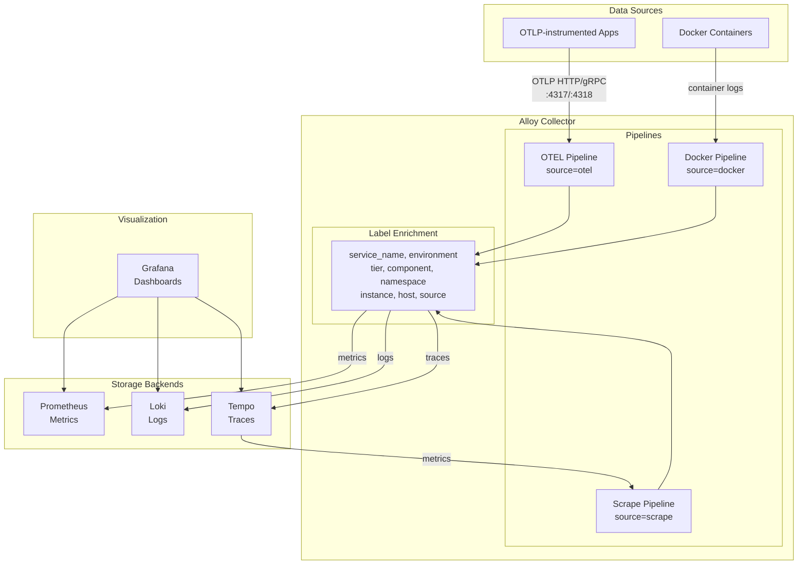

# Observability Stack

Centralized observability platform providing metrics, logs, and traces collection with unified dashboards.

## Architecture



## Label Schema

Unified labeling across all data pipelines for consistent querying and correlation.

### Label Hierarchy

Labels are applied in hierarchical order from broadest to most specific:

```
namespace → service → component → role → tier → env
```

| Order | Label | Description | Example Values |
|-------|-------|-------------|----------------|
| 1 | `namespace` | Stack/project grouping | `infra`, `firefly`, `n8n`, `observability` |
| 2 | `service` | Service identifier | `nginx`, `prometheus`, `firefly` |
| 3 | `component` | Architectural category | `app`, `data`, `gateway`, `observability` |
| 4 | `role` | Specific function | `backend`, `database`, `proxy`, `metrics` |
| 5 | `tier` | Criticality | `core`, `extra` |
| 6 | `env` | Deployment environment | `production` |

### Tier Values

| Value | Description |
|-------|-------------|
| `core` | Essential services for stack functionality |
| `extra` | Optional/enhancement services |

### Component Values (standardized)

| Value | Description |
|-------|-------------|
| `app` | Application servers, APIs, web UIs, backends |
| `data` | Databases (postgres, mysql, mariadb, clickhouse) |
| `storage` | Object/file storage (minio, s3) |
| `cache` | Caching layers (redis, valkey) |
| `worker` | Background processors, schedulers |
| `gateway` | Reverse proxies, load balancers, tunnels |
| `network` | DNS, DHCP, networking services |
| `observability` | Monitoring, logging, tracing, metrics |

### Role Values (free-form)

Specific function within the component. Examples:
- `backend`, `frontend`, `web`, `api`
- `database`, `analytics`
- `proxy`, `tunnel`
- `metrics`, `logs`, `traces`, `collector`
- `scheduler`, `importer`, `processor`
- `dns`, `dashboard`, `management`

### Full Label Reference

| Label | Description | Docker Label | OTEL Attribute |
|-------|-------------|--------------|----------------|
| `namespace` | Stack/project grouping | `com.giocaizzi.namespace` | - |
| `service_name` | Service identifier | `com.giocaizzi.service` | `service.name` |
| `component` | Architectural category | `com.giocaizzi.component` | - |
| `role` | Specific function | `com.giocaizzi.role` | - |
| `tier` | Service tier (core/extra) | `com.giocaizzi.tier` | - |
| `environment` | Deployment environment | `com.giocaizzi.env` | `deployment.environment` |
| `version` | Service version | `com.giocaizzi.version` | `service.version` |
| `instance` | Container/pod ID | (auto: container ID) | `service.instance.id` |
| `host` | Hostname | (auto: hostname) | `host.name` |
| `source` | Data pipeline origin | (auto: docker) | (auto: otel) |

### Source Values
- `otel` - Data received via OTLP endpoint from instrumented apps
- `docker` - Container logs scraped from Docker socket
- `scrape` - Metrics scraped via Prometheus endpoints

## Components

| Service | Port | Purpose |
|---------|------|---------|
| **Prometheus** | 9090 | Metrics storage with remote write receiver |
| **Loki** | 3100 | Log aggregation and querying |
| **Tempo** | 3200, 4317, 4318 | Distributed tracing backend |
| **Alloy** | 4317, 4318, 12345 | OpenTelemetry collector, Docker log scraping |
| **Grafana** | 3000 | Dashboards and visualization |

## Data Flow

1. **Metrics**: Applications → OTLP → Alloy → Prometheus
2. **Logs**: Docker containers → Alloy (autodiscovery) → Loki
3. **Traces**: Applications → OTLP → Alloy → Tempo

## Deployment

Deployed via Portainer using the remote repository feature in Swarm mode.

### Prerequisites

1. Create required secrets in `secrets/`:
   ```bash
   cp secrets/grafana_admin_password.txt.example secrets/grafana_admin_password.txt
   # Edit with actual value
   ```

2. Ensure networks exist:
   ```bash
   docker network create --driver overlay --attachable rp5_public
   ```

### Deploy via Portainer

1. Navigate to **Stacks** in Portainer
2. Click **Add Stack**
3. Select **Repository**
4. Configure:
   - Repository URL: `https://github.com/<owner>/rp5-homeserver`
   - Branch: `main`
   - Compose path: `services/observability/docker-compose.yml`
5. Deploy the stack

## Accessing Services

Services are accessed via nginx reverse proxy using `.home` domains (DNS configured via AdGuard).

| Service | URL | Purpose |
|---------|-----|---------|
| **Grafana** | `https://grafana.home` | Dashboards, queries, alerts |
| **OTLP HTTP** | `https://otel.home` | Telemetry ingestion endpoint |

### OTLP Endpoints

Applications send telemetry to Alloy via OTLP:

- **HTTP**: `https://otel.home` (via nginx) or `http://alloy:4318` (internal)
- **gRPC**: `alloy:4317` (internal only, no nginx proxy for gRPC)

For internal services on the same Docker network, use direct service names:
```
http://alloy:4318  # OTLP HTTP
alloy:4317         # OTLP gRPC
```

## Instrumenting Applications

### Required Labels

When sending OTLP data, include these resource attributes:

```yaml
environment:
  - OTEL_SERVICE_NAME=my-service
  - OTEL_RESOURCE_ATTRIBUTES=deployment.environment.name=production,service.version=1.0.0
  - OTEL_EXPORTER_OTLP_ENDPOINT=http://alloy:4318
```

Default values applied by Alloy if not provided:
- `environment`: `production`
- `tier`: `app`
- `namespace`: `external`

### Python Example

```python
from opentelemetry import trace
from opentelemetry.exporter.otlp.proto.grpc.trace_exporter import OTLPSpanExporter
from opentelemetry.sdk.trace import TracerProvider
from opentelemetry.sdk.trace.export import BatchSpanProcessor
from opentelemetry.sdk.resources import Resource

resource = Resource.create({
    "service.name": "my-service",
    "service.version": "1.0.0",
    "deployment.environment.name": "production",
})

exporter = OTLPSpanExporter(endpoint="alloy:4317", insecure=True)
provider = TracerProvider(resource=resource)
provider.add_span_processor(BatchSpanProcessor(exporter))
trace.set_tracer_provider(provider)
```

## Retention & Resources

| Data Type | Retention | Service Memory |
|-----------|-----------|----------------|
| Metrics | 30 days | 512MB |
| Logs | 30 days | 512MB |
| Traces | 30 days | 512MB |
| Alloy | - | 256MB |
| Grafana | - | 256MB |

## Troubleshooting

### Check Service Health

```bash
docker service ls | grep observability
docker service logs observability_alloy
```

### Verify Data Flow

1. **Metrics**: Grafana → Explore → Prometheus → query `{source="otel"}`
2. **Logs**: Grafana → Explore → Loki → query `{source="docker"}`
3. **Traces**: Grafana → Explore → Tempo → search by service name

### Common Issues

| Issue | Solution |
|-------|----------|
| No Docker logs | Verify `/var/run/docker.sock` is mounted in Alloy |
| Missing labels | Check container has `com.giocaizzi.*` labels |
| OTLP connection refused | Verify Alloy is on `rp5_public` network |
