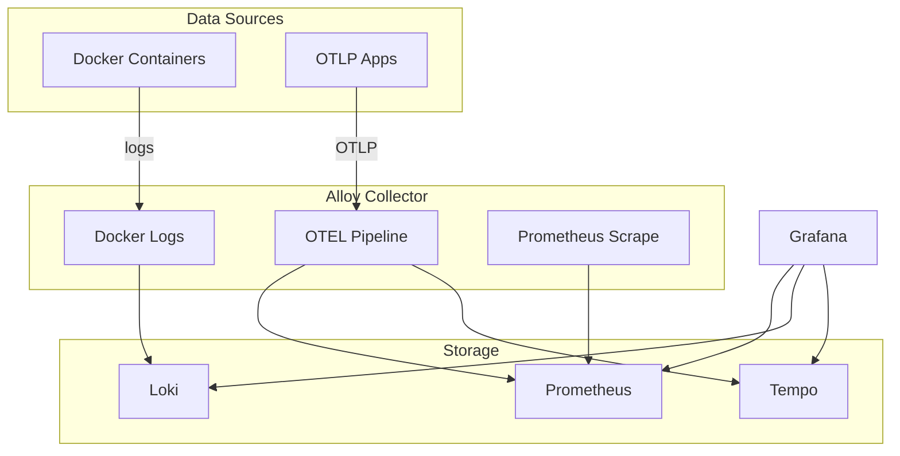

# 📊 Observability

> Centralized monitoring with metrics, logs, and traces

**URLs**:
- Grafana: `https://grafana.home`
- OTLP HTTP: `https://otel.home`

---

## 🚀 Quick Start

1. Create secrets (see below)
2. Deploy via Portainer → Swarm mode
3. Access Grafana at `https://grafana.home`

---

## 📦 Architecture



| Container | Image | Purpose |
|-----------|-------|---------|
| prometheus | `prom/prometheus:latest` | Metrics TSDB |
| loki | `grafana/loki:latest` | Log aggregation |
| tempo | `grafana/tempo:latest` | Distributed tracing |
| alloy | `grafana/alloy:latest` | OTEL collector |
| grafana | `grafana/grafana:latest` | Dashboards |

---

## 🔐 Secrets

| Secret | Generate |
|--------|----------|
| `observability_grafana_admin_password` | `openssl rand -base64 32 \| docker secret create observability_grafana_admin_password -` |

---

## ⚙️ Configuration

Config files:

| Directory | Purpose |
|-----------|---------|
| `./prometheus/` | Scrape targets |
| `./loki/` | Log storage config |
| `./tempo/` | Trace storage config |
| `./alloy/` | OTEL collector pipelines |
| `./grafana/provisioning/` | Datasources, dashboards |

### Alloy Modular Architecture

```
alloy/
├── config.alloy           # Entry point - imports, discovery, outputs
├── modules/
│   └── labels.alloy       # Reusable label extraction (declare blocks)
└── pipelines/
    ├── otel.alloy         # OTLP receivers → processors → exporters
    ├── logs.alloy         # Docker log collection → Loki
    └── metrics.alloy      # Prometheus scraping → remote_write
```

**Data Flow:**
- OTLP → `otel.alloy` → Prometheus/Loki/Tempo
- Docker containers → `logs.alloy` → Loki
- Exporters → `metrics.alloy` → Prometheus

**Modules:**
- `modules/labels.alloy` contains `declare` blocks for reusable label extraction
- Used by both logs and metrics pipelines for consistent labeling

---

## 📖 OTEL Integration

### Endpoints

| Protocol | Internal | External |
|----------|----------|----------|
| OTLP gRPC | `alloy:4317` | — |
| OTLP HTTP | `http://alloy:4318` | `https://otel.home` |

### Python Example

```python
from opentelemetry import trace
from opentelemetry.exporter.otlp.proto.grpc.trace_exporter import OTLPSpanExporter
from opentelemetry.sdk.trace import TracerProvider
from opentelemetry.sdk.trace.export import BatchSpanProcessor
from opentelemetry.sdk.resources import Resource

resource = Resource.create({
    "service.name": "my-service",
    "deployment.environment.name": "production",
})

exporter = OTLPSpanExporter(endpoint="alloy:4317", insecure=True)
provider = TracerProvider(resource=resource)
provider.add_span_processor(BatchSpanProcessor(exporter))
trace.set_tracer_provider(provider)
```

### Environment Variables

```yaml
environment:
  - OTEL_SERVICE_NAME=my-service
  - OTEL_RESOURCE_ATTRIBUTES=deployment.environment.name=production
  - OTEL_EXPORTER_OTLP_ENDPOINT=http://alloy:4318
```

---

## 🏷️ Label Schema

See [alloy/README.md](./alloy/README.md) for full reference.

Key labels applied by Alloy (OTEL-compliant names):

| Label | Source | Example |
|-------|--------|--------|
| `service_namespace` | `com.giocaizzi.namespace` | `infra`, `n8n` |
| `service_name` | `com.giocaizzi.service` | `nginx`, `prometheus` |
| `deployment_environment_name` | `com.giocaizzi.env` | `production` |
| `technology` | `com.giocaizzi.technology` | `postgres`, `redis`, `nginx` |
| `tier` | `com.giocaizzi.tier` | `core`, `extra` |
| `component` | `com.giocaizzi.component` | `app`, `data`, `worker`, `gateway` |
| `source` | Auto-detected | `otel`, `docker`, `scrape` |
| `level` | Extracted | `info`, `error`, `warn` |

**Structured Metadata (high cardinality):** `service_instance_id`, `service_version`, `host_name`, `role`

---

## 💾 Volumes

| Volume | Purpose |
|--------|---------|
| `prometheus_data` | Metrics TSDB (30d retention) |
| `loki_data` | Log storage (30d retention) |
| `tempo_data` | Trace storage (30d retention) |
| `grafana_data` | Dashboards, plugins |
| `alloy_data` | Collector state |


