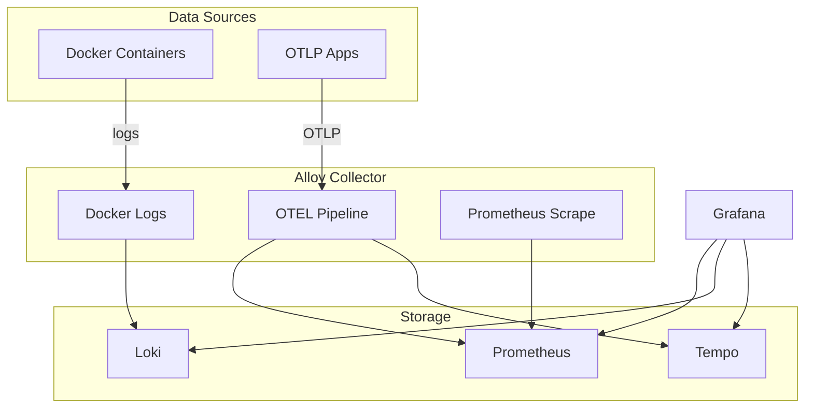

# 📊 Observability

> Centralized monitoring with metrics, logs, and traces

**URLs**:
- Grafana: `https://grafana.home`
- OTLP HTTP (LAN): `https://otel.home`
- OTLP HTTP (public): `https://otel.giocaizzi.xyz` — CF Access bypass on `/v1/*` + Alloy bearer auth

---

## 🚀 Quick Start

1. Create secrets (see below)
2. Deploy via Portainer → Swarm mode
3. Access Grafana at `https://grafana.home`

---

## 📦 Architecture


```mermaid
flowchart TB
    subgraph sources["Data Sources"]
        docker["Docker Containers"]
        apps["OTLP Apps"]
    end

    subgraph collector["Alloy Collector"]
        otel["OTEL Pipeline"]
        docker_logs["Docker Logs"]
        scrape["Prometheus Scrape"]
    end

    subgraph backends["Storage"]
        prometheus["Prometheus"]
        loki["Loki"]
        tempo["Tempo"]
    end
    
    grafana["Grafana"]

    apps -->|"OTLP"| otel
    docker -->|"logs"| docker_logs
    
    otel --> prometheus
    otel --> tempo
    docker_logs --> loki
    scrape --> prometheus
    
    grafana --> prometheus
    grafana --> loki
    grafana --> tempo
```

| Container | Image | Purpose |
|-----------|-------|---------|
| prometheus | `prom/prometheus:latest` | Metrics TSDB |
| loki | `grafana/loki:latest` | Log aggregation |
| tempo | `grafana/tempo:latest` | Distributed tracing |
| alloy | `grafana/alloy:latest` | OTEL collector |
| grafana | `grafana/grafana:latest` | Dashboards |

---

## 🔐 Secrets

| Secret | Generate |
|--------|----------|
| `observability_grafana_admin_password` | `openssl rand -base64 32 \| docker secret create observability_grafana_admin_password -` |
| `observability_alloy_otel_bearer_token` | `openssl rand -base64 48 \| tr -d '\n=' \| tr '+/' '-_' > services/observability/secrets/alloy_otel_bearer_token.txt` then `PI_SSH_USER=$USER ./scripts/create_secrets.sh observability` |

The bearer token is the **inner** auth gate on the OTLP HTTP receiver (port 4318). It is enforced for **both** `otel.home` (LAN) and `otel.giocaizzi.xyz` (public via CF Access bypass) — the receiver does not distinguish between sources.

> The matching CF service-token credentials (`CF-Access-Client-Id` / `CF-Access-Client-Secret`) for the public path live in Terraform outputs `otel_ingest_client_id` / `otel_ingest_client_secret` (see `cloud/outputs.tf`).

---

## ⚙️ Configuration

Config files:

| Directory | Purpose |
|-----------|---------|
| `./prometheus/` | Scrape targets |
| `./loki/` | Log storage config |
| `./tempo/` | Trace storage config |
| `./alloy/` | OTEL collector pipelines |
| `./grafana/provisioning/` | Datasources, dashboards |

### Alloy Modular Architecture

```
alloy/
├── config.alloy           # Entry point - imports, discovery, outputs
├── modules/
│   └── labels.alloy       # Reusable label extraction (declare blocks)
└── pipelines/
    ├── otel.alloy         # OTLP receivers → processors → exporters
    ├── logs.alloy         # Docker log collection → Loki
    └── metrics.alloy      # Prometheus scraping → remote_write
```

**Data Flow:**
- OTLP → `otel.alloy` → Prometheus/Loki/Tempo
- Docker containers → `logs.alloy` → Loki
- Exporters → `metrics.alloy` → Prometheus

**Modules:**
- `modules/labels.alloy` contains `declare` blocks for reusable label extraction
- Used by both logs and metrics pipelines for consistent labeling

---

## 📖 OTEL Integration

### Endpoints

| Protocol | Endpoint | Auth |
|----------|----------|------|
| OTLP gRPC | `observability-collector:4317` (overlay only) | none — Swarm-internal |
| OTLP HTTP | `http://observability-collector:4318` (overlay) | bearer token |
| OTLP HTTP | `https://otel.home` (LAN) | bearer token |
| OTLP HTTP | `https://otel.giocaizzi.xyz` (public) | CF Access service token (outer) + bearer token (inner) |

### Environment Variables

LAN client (HTTP, bearer only):

```yaml
environment:
  - OTEL_SERVICE_NAME=my-service
  - OTEL_RESOURCE_ATTRIBUTES=deployment.environment.name=production
  - OTEL_EXPORTER_OTLP_ENDPOINT=https://otel.home
  - OTEL_EXPORTER_OTLP_HEADERS=Authorization=Bearer ${BEARER}
```

Public client (HTTP, CF Access bypass + bearer):

```yaml
environment:
  - OTEL_EXPORTER_OTLP_ENDPOINT=https://otel.giocaizzi.xyz
  - OTEL_EXPORTER_OTLP_HEADERS=CF-Access-Client-Id=${CF_ID},CF-Access-Client-Secret=${CF_SECRET},Authorization=Bearer ${BEARER}
```

Overlay client (gRPC, no auth — Swarm-internal only):

```python
from opentelemetry.exporter.otlp.proto.grpc.trace_exporter import OTLPSpanExporter
exporter = OTLPSpanExporter(endpoint="observability-collector:4317", insecure=True)
```

---

## 🏷️ Label Schema

See [alloy/README.md](./alloy/README.md) for full reference.

Key labels applied by Alloy (OTEL-compliant names):

| Label | Source | Example |
|-------|--------|--------|
| `service_namespace` | `com.giocaizzi.namespace` | `infra`, `n8n` |
| `service_name` | `com.giocaizzi.service` | `nginx`, `prometheus` |
| `deployment_environment_name` | `com.giocaizzi.env` | `production` |
| `technology` | `com.giocaizzi.technology` | `postgres`, `redis`, `nginx` |
| `tier` | `com.giocaizzi.tier` | `core`, `extra` |
| `component` | `com.giocaizzi.component` | `app`, `data`, `worker`, `gateway` |
| `source` | Auto-detected | `otel`, `docker`, `scrape` |
| `level` | Extracted | `info`, `error`, `warn` |

**Structured Metadata (high cardinality):** `service_instance_id`, `service_version`, `host_name`, `role`

---

## 💾 Volumes

| Volume | Purpose |
|--------|---------|
| `prometheus_data` | Metrics TSDB (30d retention) |
| `loki_data` | Log storage (30d retention) |
| `tempo_data` | Trace storage (30d retention) |
| `grafana_data` | Dashboards, plugins |
| `alloy_data` | Collector state |


