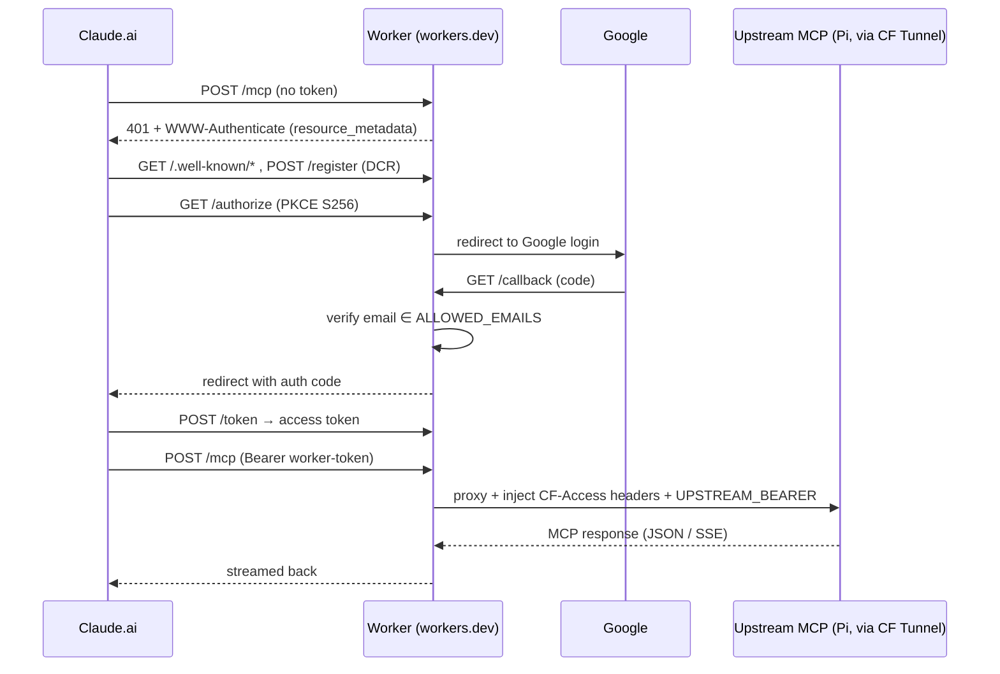

# 🔌 mcp-connector — Claude.ai MCP connectors for self-hosted servers

A single Cloudflare Worker codebase, deployed once per upstream, that makes a
self-hosted MCP server connectable from **Claude.ai (web + Desktop)** as a custom
connector — with OAuth login gated to the owner's Google identity and the origin
never exposed unauthenticated.

Live connectors:

| Service    | Connector URL (add this in Claude.ai)                          | Upstream MCP endpoint (on the Pi)                  |
|------------|----------------------------------------------------------------|---------------------------------------------------|
| Greenhouse | `https://mcp-connector-greenhouse.giocaizzi.workers.dev/mcp`   | `https://greenhouse.giocaizzi.xyz/mcp`            |
| Firefly III| `https://mcp-connector-firefly.giocaizzi.workers.dev/mcp`      | `https://firefly.giocaizzi.xyz/api/v1/mcp`        |
| n8n        | `https://mcp-connector-n8n.giocaizzi.workers.dev/mcp`          | `https://n8n.giocaizzi.xyz/mcp-server/http`       |

---

## 🚀 Quick Start

Add a connector in Claude.ai → **Settings → Connectors → Add custom connector**,
paste the connector URL above, and complete the Google login. That's it — Claude.ai
self-registers (DCR), runs OAuth, and starts an MCP session.

To deploy/operate the Workers yourself, see [Deployment](#-deployment).

---

## 📦 Architecture

The Worker is **both** the OAuth 2.1 authorization server **and** the MCP resource,
on **one origin**. That single-origin property is the whole point (see
[Why a Worker](#-why-a-worker-design-rationale)). Login is delegated to Google;
the `/mcp` route is a token-gated reverse proxy to the Pi.



**Files**

| File                | Role                                                                       |
|---------------------|----------------------------------------------------------------------------|
| `src/index.ts`      | Wires `OAuthProvider` (apiRoute `/mcp`, Google default handler).            |
| `src/google-handler.ts` | `/authorize` → Google; `/callback` → email allowlist → complete auth.   |
| `src/proxy.ts`      | Token-gated `/mcp` reverse proxy; injects upstream auth; streams response.  |
| `src/env.ts`        | Typed bindings (vars + secrets + KV + OAuthProvider).                       |
| `wrangler.jsonc`    | One `env.<service>` per upstream (name, vars, KV id).                       |
| `deploy.sh`         | Idempotent deploy + secret-setting helper (pulls CF Access creds from TF).  |

---

## 🔐 Security model

Three independent gates protect the Pi origin; all must pass:

1. **Identity (who):** OAuth login via Google, restricted to `ALLOWED_EMAILS`.
   Only the owner can obtain a Worker access token.
2. **Cloudflare Access (edge):** the upstream hostname sits behind a path-scoped
   Access app. The Worker carries `CF-Access-Client-Id/Secret` for a `bypass`
   policy; no one else traverses Access to the origin.
3. **App bearer (origin):** the MCP server itself validates `Authorization:
   Bearer <UPSTREAM_BEARER>` (Firefly Passport PAT / n8n MCP token / greenhouse
   token). Fail-closed.

Secrets never touch Claude.ai or the browser — the Worker swaps Claude's OAuth
token for the upstream credentials server-side. The CF Access service-token
credentials and the `<svc>_mcp_policy` bypass apps are defined in `cloud/` (Terraform).

---

## 🔑 Secrets

Per-service, set with `wrangler secret put <NAME> --env <service>` (write-only;
never in `wrangler.jsonc`, never in argv with the value inline):

| Secret                  | Value                                                                  |
|-------------------------|------------------------------------------------------------------------|
| `GOOGLE_CLIENT_ID`      | Google OAuth "Web application" client id (shared across all three).    |
| `GOOGLE_CLIENT_SECRET`  | …its secret (shared).                                                  |
| `UPSTREAM_BEARER`       | App-level bearer the upstream validates (per service — see below).      |
| `CF_ACCESS_CLIENT_ID`   | `terraform -chdir=cloud output -raw claude_<svc>_mcp_client_id`.        |
| `CF_ACCESS_CLIENT_SECRET` | `terraform -chdir=cloud output -raw claude_<svc>_mcp_client_secret`. |

`UPSTREAM_BEARER` per service:
- **firefly** — a Firefly III Personal Access Token (Profile → OAuth → Personal Access Tokens).
- **n8n** — the bearer of the n8n MCP Server Trigger node.
- **greenhouse** — the greenhouse `MCP_TOKEN`.

**Google OAuth client** — one "Web application" client, with all three callback
URLs registered as Authorized redirect URIs:
```
https://mcp-connector-greenhouse.giocaizzi.workers.dev/callback
https://mcp-connector-firefly.giocaizzi.workers.dev/callback
https://mcp-connector-n8n.giocaizzi.workers.dev/callback
```

---

## ⚙️ Configuration

Non-secret, per-service `vars` live in `wrangler.jsonc`:

- `SERVICE_NAME` — display/log label.
- `UPSTREAM_URL` — the **full** upstream MCP endpoint (path included).
- `ALLOWED_EMAILS` — comma-separated login allowlist.

Each env also binds a dedicated **KV namespace** (`OAUTH_KV`) that stores OAuth
grants/tokens. KV ids are committed in `wrangler.jsonc`; create new ones with
`wrangler kv namespace create OAUTH_KV --env <service>`.

---

## 🚢 Deployment

```bash
cd workers/mcp-connector
npm install
npx wrangler login

# guided: creates KV (if needed), deploys each env, sets secrets
./deploy.sh

# or per service
npx wrangler deploy --env <greenhouse|firefly|n8n>
npm run typecheck
```

**Logs / debugging:** `npx wrangler tail --env <service> --format pretty`. The
proxy logs a one-line `warn` on any non-2xx upstream response (status +
content-type, never the body) — enough to distinguish an origin WAF block
(`403 text/plain`), a bad bearer (`401`), and an app error.

---

## 💡 Why a Worker (design rationale)

The earlier attempt used Cloudflare Access **"MCP Server Portals."** They deployed
and were OAuth-compliant, but Claude.ai web/Desktop **could not complete a session**
because the portal's authorization server lived on a *separate* host
(`*.cloudflareaccess.com`) from the MCP resource. Claude.ai's connector expects the
authorization server and the resource on the **same origin** (and trips Anthropic
bug #291 otherwise). The Worker collapses both onto one `workers.dev` origin, which
is exactly what Claude.ai handles — proven working for all three connectors.

### ⚠️ Gotcha: don't forward the browser's headers to the origin

Claude.ai's `/mcp` requests carry a large browser/SDK header set (`User-Agent`,
`sec-*`, `x-stainless-*`, tracing…). Forwarding that wholesale to a
Cloudflare-proxied origin trips a **WAF managed rule** → `403 "Your request was
blocked."`, which Claude.ai surfaces as *"Authorization with the MCP server failed."*
`proxy.ts` therefore forwards only an **allowlist** of MCP-required headers
(`content-type`, `accept`, `mcp-session-id`, `mcp-protocol-version`,
`last-event-id`) plus the injected auth and a stable `User-Agent`.

### Tool-name limit

Claude.ai rejects tool names longer than **64 characters**. An upstream whose MCP
tool names exceed that will connect but fail to load tools. (greenhouse hit this —
tracked in `giocaizzi/greenhouse#62`; the connector itself is fine.)
